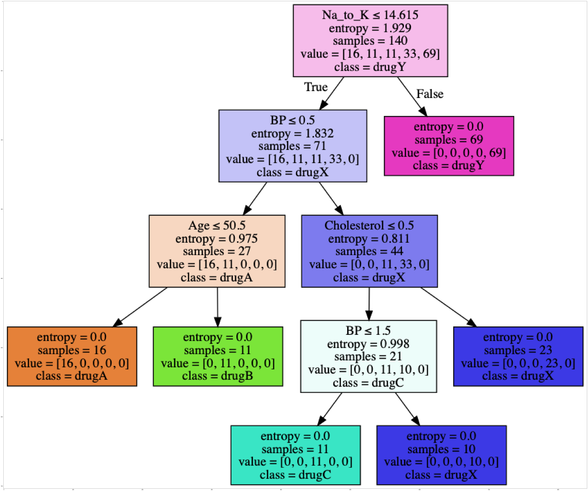

```python
import numpy as np 
import pandas as pd
from sklearn.tree import DecisionTreeClassifier
```


```python
df=pd.read_csv('https://s3-api.us-geo.objectstorage.softlayer.net/cf-courses-data/CognitiveClass/ML0101ENv3/labs/drug200.csv')
print(df.columns)
print(df.head(3))
```

    Index(['Age', 'Sex', 'BP', 'Cholesterol', 'Na_to_K', 'Drug'], dtype='object')
       Age Sex    BP Cholesterol  Na_to_K   Drug
    0   23   F  HIGH        HIGH   25.355  drugY
    1   47   M   LOW        HIGH   13.093  drugC
    2   47   M   LOW        HIGH   10.114  drugC


```python
x = df[['Age', 'Sex', 'BP', 'Cholesterol', 'Na_to_K']]
# print(x)
```


```python
from sklearn import preprocessing
le_sex = preprocessing.LabelEncoder()
# # le_sex.fit(['F','M'])
##dfx['Sex'] = le_sex.transform(x.iloc[:,1])
dfx=x
dfx['Sex'] = le_sex.fit_transform(x.iloc[:,1]) 
print(dfx.head())
```

       Age  Sex      BP Cholesterol  Na_to_K
    0   23    0    HIGH        HIGH   25.355
    1   47    1     LOW        HIGH   13.093
    2   47    1     LOW        HIGH   10.114
    3   28    0  NORMAL        HIGH    7.798
    4   61    0     LOW        HIGH   18.043


    /Users/devi/anaconda3/lib/python3.7/site-packages/ipykernel_launcher.py:6: SettingWithCopyWarning: 
    A value is trying to be set on a copy of a slice from a DataFrame.
    Try using .loc[row_indexer,col_indexer] = value instead
    
    See the caveats in the documentation: http://pandas.pydata.org/pandas-docs/stable/indexing.html#indexing-view-versus-copy
      


```python
le_BP = preprocessing.LabelEncoder()
# le_BP.fit([ 'LOW', 'NORMAL', 'HIGH'])
dfx.iloc[:,2] = le_BP.fit_transform(x.iloc[:,2])
dfx.head()
```

    /Users/devi/anaconda3/lib/python3.7/site-packages/pandas/core/indexing.py:543: SettingWithCopyWarning: 
    A value is trying to be set on a copy of a slice from a DataFrame.
    Try using .loc[row_indexer,col_indexer] = value instead
    
    See the caveats in the documentation: http://pandas.pydata.org/pandas-docs/stable/indexing.html#indexing-view-versus-copy
      self.obj[item] = s


<div>
<style scoped>
    .dataframe tbody tr th:only-of-type {
        vertical-align: middle;
    }

    .dataframe tbody tr th {
        vertical-align: top;
    }

    .dataframe thead th {
        text-align: right;
    }
</style>
<table border="1" class="dataframe">
  <thead>
    <tr style="text-align: right;">
      <th></th>
      <th>Age</th>
      <th>Sex</th>
      <th>BP</th>
      <th>Cholesterol</th>
      <th>Na_to_K</th>
    </tr>
  </thead>
  <tbody>
    <tr>
      <th>0</th>
      <td>23</td>
      <td>0</td>
      <td>0</td>
      <td>HIGH</td>
      <td>25.355</td>
    </tr>
    <tr>
      <th>1</th>
      <td>47</td>
      <td>1</td>
      <td>1</td>
      <td>HIGH</td>
      <td>13.093</td>
    </tr>
    <tr>
      <th>2</th>
      <td>47</td>
      <td>1</td>
      <td>1</td>
      <td>HIGH</td>
      <td>10.114</td>
    </tr>
    <tr>
      <th>3</th>
      <td>28</td>
      <td>0</td>
      <td>2</td>
      <td>HIGH</td>
      <td>7.798</td>
    </tr>
    <tr>
      <th>4</th>
      <td>61</td>
      <td>0</td>
      <td>1</td>
      <td>HIGH</td>
      <td>18.043</td>
    </tr>
  </tbody>
</table>
</div>


```python
le_Chol = preprocessing.LabelEncoder()
le_Chol.fit([ 'NORMAL', 'HIGH'])
dfx.iloc[:,3] = le_Chol.transform(x.iloc[:,3]) 
dfx.head()
```


<div>
<style scoped>
    .dataframe tbody tr th:only-of-type {
        vertical-align: middle;
    }

    .dataframe tbody tr th {
        vertical-align: top;
    }

    .dataframe thead th {
        text-align: right;
    }
</style>
<table border="1" class="dataframe">
  <thead>
    <tr style="text-align: right;">
      <th></th>
      <th>Age</th>
      <th>Sex</th>
      <th>BP</th>
      <th>Cholesterol</th>
      <th>Na_to_K</th>
    </tr>
  </thead>
  <tbody>
    <tr>
      <th>0</th>
      <td>23</td>
      <td>0</td>
      <td>0</td>
      <td>0</td>
      <td>25.355</td>
    </tr>
    <tr>
      <th>1</th>
      <td>47</td>
      <td>1</td>
      <td>1</td>
      <td>0</td>
      <td>13.093</td>
    </tr>
    <tr>
      <th>2</th>
      <td>47</td>
      <td>1</td>
      <td>1</td>
      <td>0</td>
      <td>10.114</td>
    </tr>
    <tr>
      <th>3</th>
      <td>28</td>
      <td>0</td>
      <td>2</td>
      <td>0</td>
      <td>7.798</td>
    </tr>
    <tr>
      <th>4</th>
      <td>61</td>
      <td>0</td>
      <td>1</td>
      <td>0</td>
      <td>18.043</td>
    </tr>
  </tbody>
</table>
</div>


```python
y = df["Drug"]
print(y.head())
```

    0    drugY
    1    drugC
    2    drugC
    3    drugX
    4    drugY
    Name: Drug, dtype: object


```python
##split
from sklearn.model_selection import train_test_split
x_trainset, x_testset, y_trainset, y_testset = train_test_split(dfx, y, test_size=0.3, random_state=3)
```


```python
##model
## We will first create an instance of the DecisionTreeClassifier called drugTree.
## Inside of the classifier, specify criterion="entropy" so we can see the information gain of each node.
##nodes correspond to the test
##branches correspond to the result of the test
drugTree=DecisionTreeClassifier(criterion='entropy',max_depth=4)
drugTree.fit(x_trainset,y_trainset)
```


    DecisionTreeClassifier(class_weight=None, criterion='entropy', max_depth=4,
                max_features=None, max_leaf_nodes=None,
                min_impurity_decrease=0.0, min_impurity_split=None,
                min_samples_leaf=1, min_samples_split=2,
                min_weight_fraction_leaf=0.0, presort=False, random_state=None,
                splitter='best')


```python
predTree = drugTree.predict(x_testset)
from sklearn import metrics
import matplotlib.pyplot as plt
print("DecisionTrees's Accuracy: ", metrics.accuracy_score(y_testset, predTree))
```

    DecisionTrees's Accuracy:  0.9833333333333333


```python
##EVALUATION
# We will first create an instance of the DecisionTreeClassifier called drugTree.
# Inside of the classifier, specify criterion="entropy" so we can see the information gain of each node.
##nodes correspond to the test
##branches correspond to the result of the test
acc=[]
for i in range(1,int(x.shape[1])+1):
    drugTree=DecisionTreeClassifier(criterion='entropy',max_depth=i)
    drugTree.fit(x_trainset,y_trainset)
    predTree = drugTree.predict(x_testset)
    ac=metrics.accuracy_score(y_testset, predTree)
    acc.append(ac)
from sklearn import metrics
# import matplotlib.pyplot as plt
# print("DecisionTrees's Accuracy: ", metrics.accuracy_score(y_testset, predTree))
print(acc)
```

    [0.7, 0.8166666666666667, 0.8166666666666667, 0.9833333333333333, 0.9833333333333333]


```python
import io
import pydotplus
import matplotlib.image as mpimg
from sklearn import tree
dot_data=io.StringIO()#Creating a text stream, StringIO can be used like a file opened in text mode
filename = "drugtree1.png"
featureNames = df.columns[0:5]
# targetNames = df["Drug"].unique().tolist()#class_names ['drugY', 'drugC', 'drugX', 'drugA', 'drugB'] yg bawah sesuai abjad
out=tree.export_graphviz(drugTree,feature_names=featureNames,out_file=dot_data, class_names= np.unique(y_trainset), filled=True,  special_characters=True,rotate=False)  
#graphviz #This module provides with a full interface to create handle modify and process graphs in Graphviz’s dot language.
graph = pydotplus.graph_from_dot_data(dot_data.getvalue())  ##prepare data to convert 
graph.write_png(filename)
img = mpimg.imread(filename)
plt.figure(figsize=(100, 200))
plt.imshow(img,interpolation='nearest')
plt.show()
```




